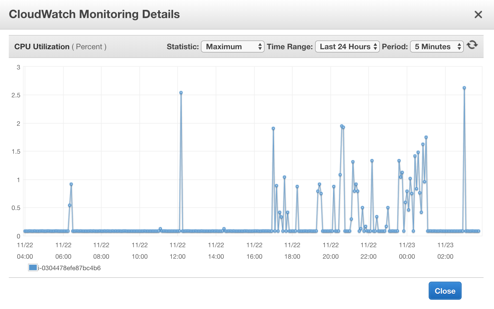

# Search Project

### Team members

* [Maria Ines Montenegro](https://github.com/MarinesM)
* [Maria Isabel Rivera](https://github.com/marisarivera)
* [Ricardo Mendoza](https://github.com/ricardojmv85)
* [Luis Angel Tortola](https://github.com/tortolala)

### User stories

* **API User:** "get related information to some keywords I may enter in a simple form. And keep those searches in my history so I can run same search again. And create as many searches as I require".
* **App Admin:** "Understand usage metrics from all users. And run reports from historical information".

### Description

Our project consists on a Main API (this repository), which handles requests by topic and fetches information form three different endpoints (Wikipedia, NewsAPI, and GoogleBooks). To improve response times, it has Redis as a cache solution. Every search made is logged through an [auxiliary API](https://github.com/Datos02-UFM/Logging-API) which receives the topic and user and stores the data using the ELK stack. Services like User History and Notifications are available through [another API](https://github.com/Datos02-UFM/History-API) and a MySQL database.

### Architecture

### Testing

Automated testing was performed using JMeter. You can find the tests used in the *test.jmx* file found in this repo.

### Response times

The response times averages obtained were well above 100ms in the tests performed. Let's see a few examples:

* 1 user doing 2250 request one after another, gave a 95% line of *77ms*, and an average of *72ms*.

* 5 simultaneous users doing 50 requests one after another,  gave a 95% line of *73ms*, and an average of *72ms*.

* 1 user doing 500 request one after another, gave a 95% line of *73ms*, and an average of *72ms*.

The greatest challenge was to eliminate abnormal responses which ruin statistical metrics, altough it was possible.

### Profiling

Last but not least, we have to ensure the **storage, I/O, and CPU,** were not being over compromised with our solution. So we needed to do some sort of profiling.

* Disk storage: trough the Elasticsearch-Head Plugin, we can see that 1MiB stores from 3000 to 4000 logs (docs), which is not bad at all.

* Disk I/O: the disk write and read operations in both servers was not even noticeable. With almost 0MiB of average in both instances and for both input and output operations.

* CPU: The CPU of both servers running is barely touched, with all-time-highs of 5% in the logging server and 3% in the main server. 

